# Refactoring2

书籍获取：[book](https://book-refactoring2.ifmicro.com)

## 1, 第一个示例
 ### 重构步骤
 - 通读全文，理解大致内容
 - 嗅出代码中坏味道
 - 确定测试用例
 - 利用重构手法重构代码
 - 测试

## 2, 重构原则
 - 重构的关键在于运用大量微小且保持软件行为的步骤，一步步达成大规模的修改。
 - 重构必须和添加功能代码分开
 - 重构的好处
   - 重构改进软件的设计
   - 重构使软件更容易理解
   - 重构帮助找到 bug
   - 重构提高编程速度
 - 事不过三，三则重构

## 3, 24个坏味道
[示例参照](https://segmentfault.com/a/1190000040173635?sort=votes)

| 坏味道          | 描述        |
| :----------     | :---------- |
| 神秘命名        | 函数模块变量和类命名，不能清晰地表明功能和用法|
| 重复代码        | 一个以上的地点看到相同的代码结构|
| 过长函数        | 函数越长，就越难理解|
| 过长参数列表    | 过长的参数列表令人迷惑，使用类或参数对象替换参数列表|
| 全局数据        | 从代码库的任何一个角落都可以修改的数据，且难于调试|
| 可变数据	      | 对数据的修改经常导致出乎意料的结果和难以发现的 bug|
| 发散式变化      | 模块经常因为不同的原因在不同的方向上发生变化|
| 霰弹式修改      | 遇到某种变化，你都必须在许多不同的类内做出许多小修改|
| 依恋情结        | 一个函数跟另一个模块中的函数或者数据交流格外频繁，远胜于在自己所处模块内部的交流|
| 数据泥团        | 一组数据项总是结伴同行，出没于一个又一个函数|
| 基本类型偏执    | 对象取代基本类型|
| 重复的switch    | 在不同的地方反复使用同样的switch 逻辑, 用多态替换|
| 循环语句        | 管道取代循环|
| 冗赘的元素      | 一个类，根本就是一个简单的函数|
| 夸夸其谈通用性  | 某个抽象类没有作用, 函数或类的唯一用户是测试用例|
| 临时字段        | 内部某个字段仅为某种特定情况而设,这样让人不易理解|
| 过长的消息链    | 一长串取值函数或一长串临时变量,使代码与查找过程结构紧密耦合|
| 中间人          | 某个类的接口有一半的函数都委托给其他类，这样就是过度运用|
| 内幕交易        | 在模块之间大量交换数据，这会增加模块间的耦合|
| 过大的类        | 单个类做太多事情，其内往往就会出现太多字段|
| 异曲同工的类    | 可以替换但是接口不一致的两个类|
| 纯数据类        | 类只是数据容器，它们被其他类过分细琐地操控着|
| 被拒绝的遗赠    | 子类复用了超类的行为，却又不愿意支持超类的接口|
| 注释            | 注释之所以存在乃是因为代码很糟糕|

## 4, 测试体系
 - 一套测试就是一个强大的 bug 侦测器，能够大大缩减查找 bug 所需的时间。
 - 测试不用多写，只要测试失败时足以识别出对应的测试就够了
 - 编写未臻完善的测试并经常运行，好过对完美测试的无尽等待。
 - 不要只考虑对的路径，也要考虑可能出错的边界条件，把测试火力集中在那儿。
 - 每当你收到 bug 报告，请先写一个单元测试来暴露这个 bug。

## 5, 重构手法

| 名称        | 动机        | 做法        |
| :---------- | :---------- | :---------- |
| 提炼函数     | 代码，理解作用，然后提炼到一个独立的函数中 | [提炼函数](#ExtractFunction) |
| 内联函数     | 函数，其内部代码和函数名称已经清晰易读     | [内联函数](#InlineFunction) |
| 提炼变量     | 局部变量帮助我们将表达式分解为比较容易管理的形式 | [提炼变量](#ExtractVariable) |
| 内联变量     | 有时候，变量名字并不比表达式本身更具表现力  | [内联变量](#InlineVariable) |
| 改变函数声明 | 好的函数声明使得给系统添加新部件很容易  | [改变函数声明](#ChangeFunctionDeclaration) |
| 封装变量     | 如果想要搬移一处被广泛使用的数据，以函数形式封装所有对该数据的访问。  | [封装变量](#EncapsulateVariable) |
| 变量改名     | 变量可以很好地解释一段程序在干什么  | [变量改名](#RenameVariable) |
| 引入参数对象 | 数据泥团，可以用数据结构替代  | [引入参数对象](#IntroduceParameterObject) |
| 函数组合成类 | 组建一个类，把已有的函数组织起来，简化函数调用  | [函数组合成类](#CombineFunctionsIntoClass) |
| 函数组合成变换| 所有计算派生数据的逻辑收拢到一处，始终在固定的地方找到和更新这些逻辑，避免重复  | [函数组合成变换](#CombineFunctionsIntoTransform) |
| 拆分阶段     | 一段代码在同时处理两件不同的事，需要拆分成各自独立的模块  | [拆分阶段](#SplitPhase) |
| 封装记录     | 以数据类取代记录，这样，如果后续其结构需要变更，封装能够更好地应对变化  | [封装记录](#EncapsulateRecord) |
| 封装集合     | 封装程序中所有可变数据  | [封装集合](#EncapsulateCollection) |
| 以对象取代基本类型| 用对象取代某个数据，可以轻松增加对该数据更多操作  | [以对象取代基本类型](#ReplacePrimitiveWithObject) |
| 以查询取代临时变量| 将变量的计算逻辑放到函数中，有助于提炼函数与原函数之间设立清晰边界  | [以查询取代临时变量](#ReplaceTempWithQuery) |
| 提炼类       |   | [提炼类](#提炼类) |
| 内联类       |   | [内联类](#内联类) |
| 隐藏委托关系 |   | [隐藏委托关系](#隐藏委托关系) |
| 移除中间人   |   | [移除中间人](#移除中间人) |
| 替换算法     |   | [替换算法](#替换算法) |
| 搬移函数     |   | [搬移函数](#搬移函数) |
| 搬移字段     |   | [搬移字段](#搬移字段) |
| 搬移语句到函数|   | [搬移语句到函数](#搬移语句到函数) |
| 搬移语句到调用者|   | [搬移语句到调用者](#搬移语句到调用者) |
| 以函数调用取代内联代码|   | [以函数调用取代内联代码](#以函数调用取代内联代码) |
| 移动语句     |   | [移动语句](#移动语句) |
| 拆分循环     |   | [拆分循环](#拆分循环) |
| 以管道取代循环|   | [以管道取代循环](#以管道取代循环) |
| 移除死代码   |   | [移除死代码](#移除死代码) |
| 拆分变量     |   | [拆分变量](#拆分变量) |
| 字段改名     |   | [字段改名](#字段改名) |
| 以查询取代派生变量|   | [以查询取代派生变量](#以查询取代派生变量) |
| 将引用对象改为值对象|   | [将引用对象改为值对象](#将引用对象改为值对象) |
| 将值对象改为引用对象|   | [将值对象改为引用对象](#将值对象改为引用对象) |
| 分解条件表达式|   | [分解条件表达式](#分解条件表达式) |
| 合并条件表达式|   | [合并条件表达式](#合并条件表达式) |
| 以卫语句取代嵌套条件表达式|   | [以卫语句取代嵌套条件表达式](#以卫语句取代嵌套条件表达式) |
| 以多态取代条件表达式|   | [以多态取代条件表达式](#以多态取代条件表达式) |
| 引入特例     |   | [引入特例](#引入特例) |
| 引入断言     |   | [引入断言](#引入断言) |
| 将查询函数和修改函数分离|   | [将查询函数和修改函数分离](#将查询函数和修改函数分离) |
| 函数参数化   |   | [函数参数化](#函数参数化) |
| 移除标记参数 |   | [移除标记参数](#移除标记参数) |
| 保持对象完整 |   | [保持对象完整](#保持对象完整) |
| 以查询取代参数|   | [以查询取代参数](#以查询取代参数) |
| 以参数取代查询|   | [以参数取代查询](#以参数取代查询) |
| 移除设值函数 |   | [移除设值函数](#移除设值函数) |
| 以工厂取代构造函数|   | [以工厂取代构造函数](#以工厂取代构造函数) |
| 以命令取代函数|   | [以命令取代函数](#以命令取代函数) |
| 以函数取代命令|   | [以函数取代命令](#以函数取代命令) |
| 函数上移     |   | [函数上移](#函数上移) |
| 字段上移     |   | [字段上移](#字段上移) |
| 构造函数本体上移|   | [构造函数本体上移](#构造函数本体上移) |
| 函数下移     |   | [函数下移](#函数下移) |
| 以子类取代类型码|   | [以子类取代类型码](#以子类取代类型码) |
| 移除子类     |   | [移除子类](#移除子类) |
| 提炼超类     |   | [提炼超类](#提炼超类) |
| 折叠继承体系 |   | [折叠继承体系](#折叠继承体系) |
| 以委托取代子类|   | [以委托取代子类](#以委托取代子类) |
| 以委托取代超类|   | [以委托取代超类](#以委托取代超类) |

## 6, 重构步骤
<h3 id="ExtractFunction">提炼函数</h3>

  1. 创造一个新函数
  1. 将待提炼的代码从源函数复制到新建的目标函数中
  1. 在提炼出的新函数中访问不到的变量, 以参数形式传递给新函数
  1. 在源函数中，将被提炼代码段替换为对目标函数的调用
  1. 查看其他代码是否有与被提炼的代码段相同或相似之处

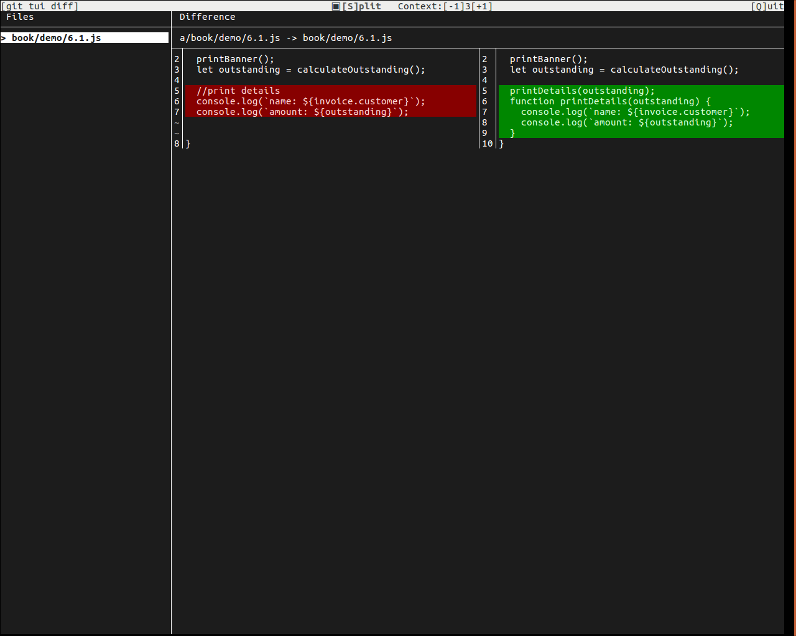
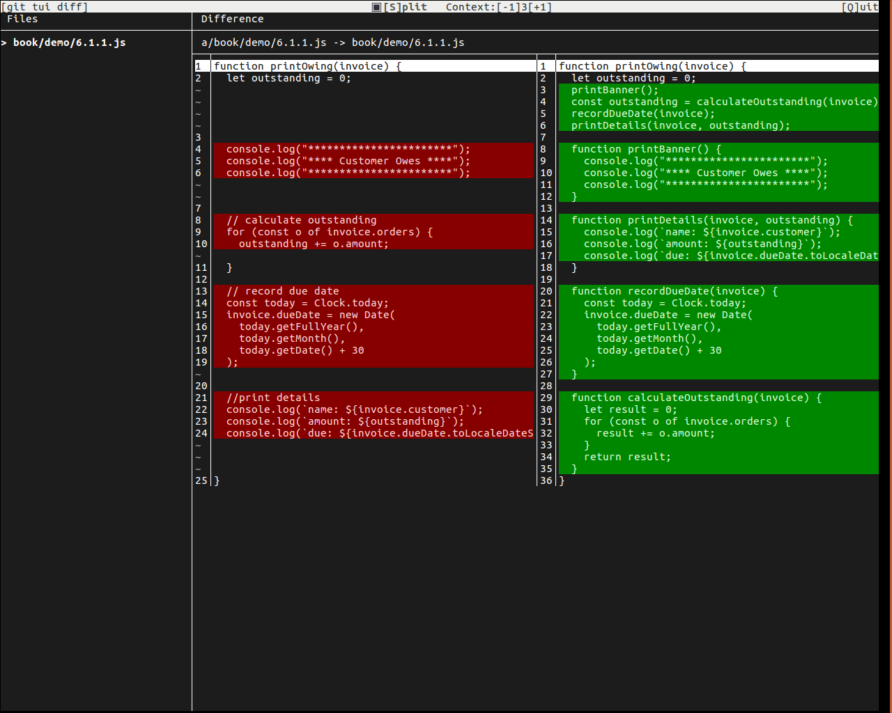
[返回](#return)

<h3 id="InlineFunction">内联函数</h3>

  1. 检查函数，确定它不具多态性
  1. 找出这个函数的所有调用点
  1. 将这个函数的所有调用点都替换为函数本体
  1. 每次替换之后，执行测试
  1. 删除该函数的定义

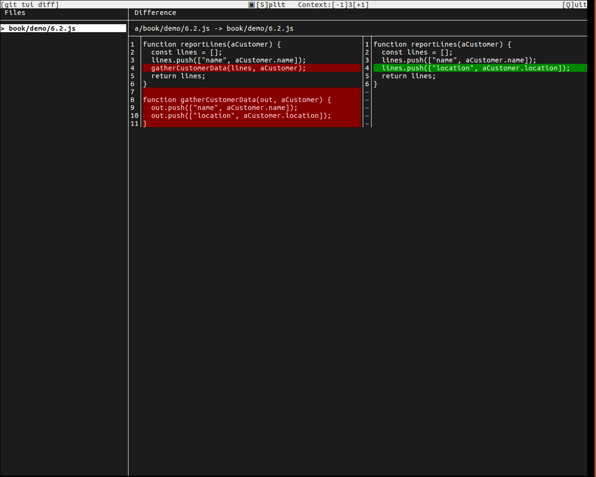
[返回](#return)

<h3 id="ExtractVariable">提炼变量</h3>

  1. 确认要提炼的表达式没有副作用
  1. 声明一个不可修改的变量，把你想要提炼的表达式复制一份，以该表达式的结果值给这个变量赋值。
  1. 用这个新变量取代原来的表达式
  1. 测试

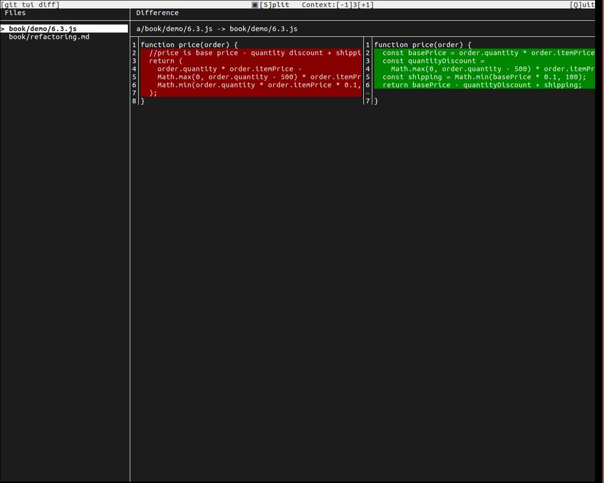
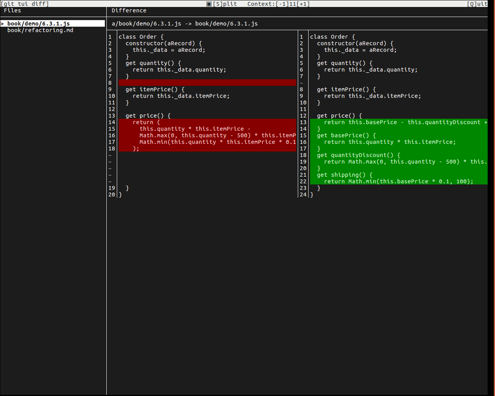
[返回](#return)

<h3 id="InlineVariable">内联变量</h3>

  1. 检查确认变量赋值语句的右侧表达式没有副作用
  1. 为了确保该变量只被赋值一次，先将变量声明为不可修改
  1. 依次找到使用该变量的地方，将其替换为直接使用赋值语句的右侧表达式
  1. 测试
  1. 删除该变量的声明点和赋值语句
  1. 测试

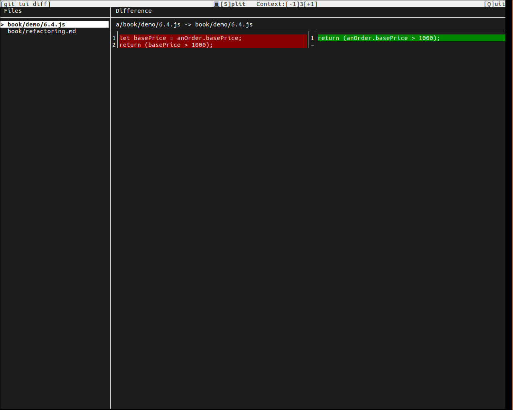
[返回](#return)

<h3 id="ChangeFunctionDeclaration">改变函数声明</h3>

  1. 如果有必要的话，先对函数体内部加以重构
  1. 使用提炼函数将函数体提炼成一个新函数
  1. 测试
  1. 对旧函数使用内联函数
  1. 再次使用改变函数声明将其改回原来的名字
  1. 测试

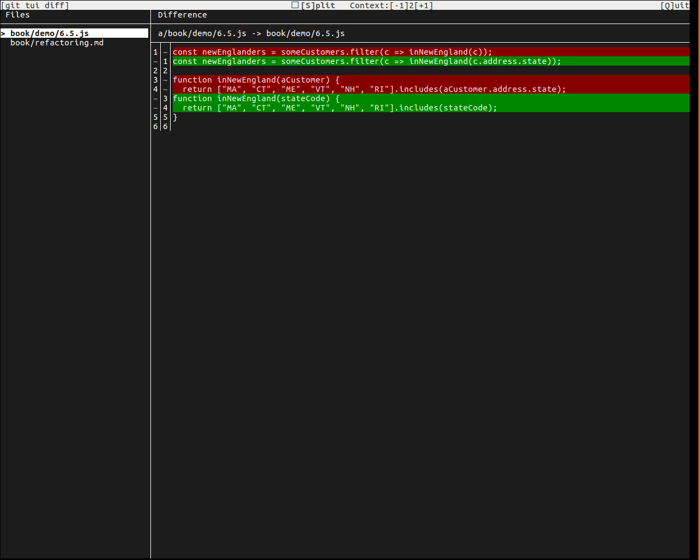
[返回](#return)

<h3 id="EncapsulateVariable">封装变量</h3>

  1. 创建封装函数，在其中访问和更新变量值
  1. 执行静态检查
  1. 逐一修改使用该变量的代码，将其改为调用合适的封装函数
  1. 每次替换之后，执行测试
  1. 限制变量的可见性
  1. 测试
  1. 如果变量的值是一个记录，考虑使用封装记录

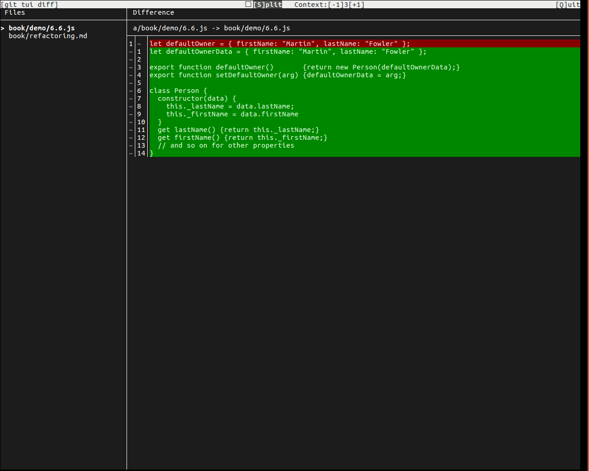
[返回](#return)

<h3 id="RenameVariable">变量改名</h3>

  1. 如果变量被广泛使用，考虑运用封装变量将其封装起来
  1. 找出所有使用该变量的代码，逐一修改
  1. 测试

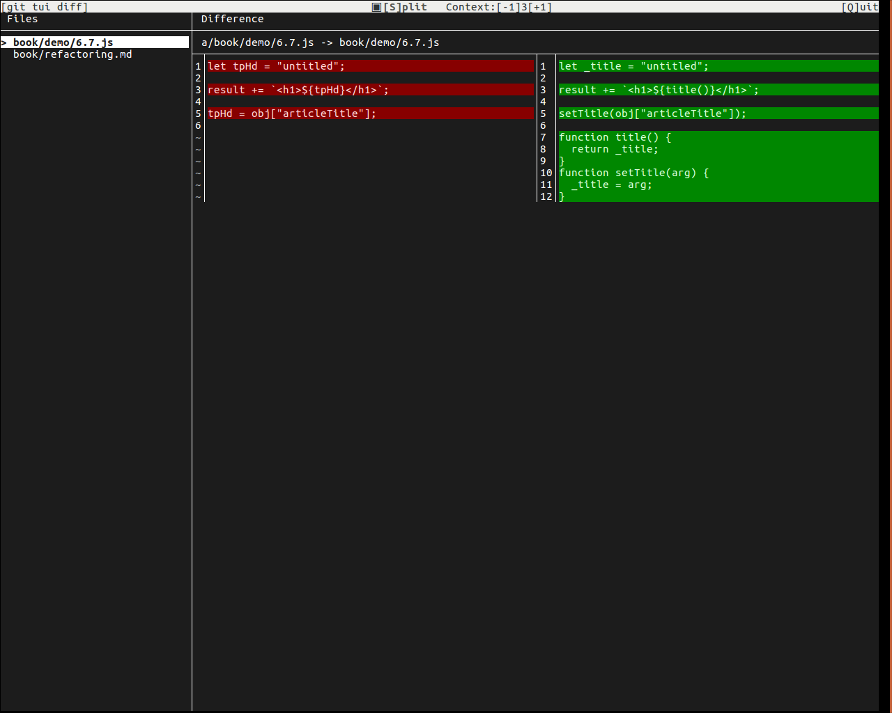
[返回](#return)

<h3 id="IntroduceParameterObject">引入参数对象</h3>

  1. 如果暂时还没有一个合适的数据结构，就创建一个
  1. 测试
  1. 使用改变函数声明给原来的函数新增一个参数，类型是新建的数据结构
  1. 测试
  1. 调整所有调用者，传入新数据结构的适当实例。每修改一处，执行测试
  1. 用新数据结构中的每项元素，逐一取代参数列表中与之对应的参数项，然后删除原来的参数
  1. 测试

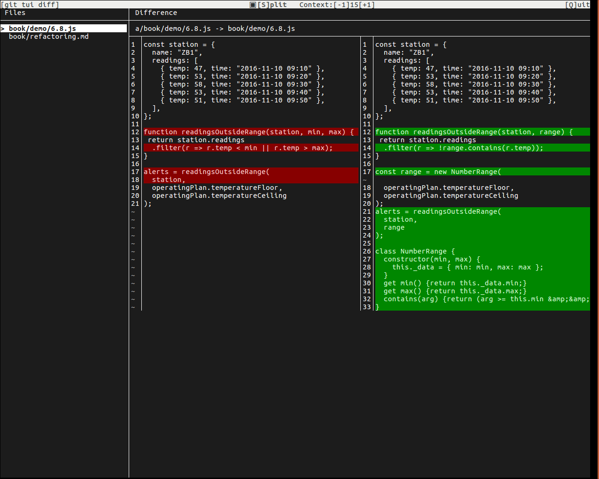
[返回](#return)

<h3 id="CombineFunctionsIntoClass">函数组合成类</h3>

  1. 运用引入参数对象将其组织成记录
  1. 运用封装记录对多个函数共用的数据记录加以封装
  1. 对于使用该记录结构的每个函数，运用搬移函数将其移入新类
  1. 用以处理该数据记录的逻辑可以用提炼函数提炼出来，并移入新类

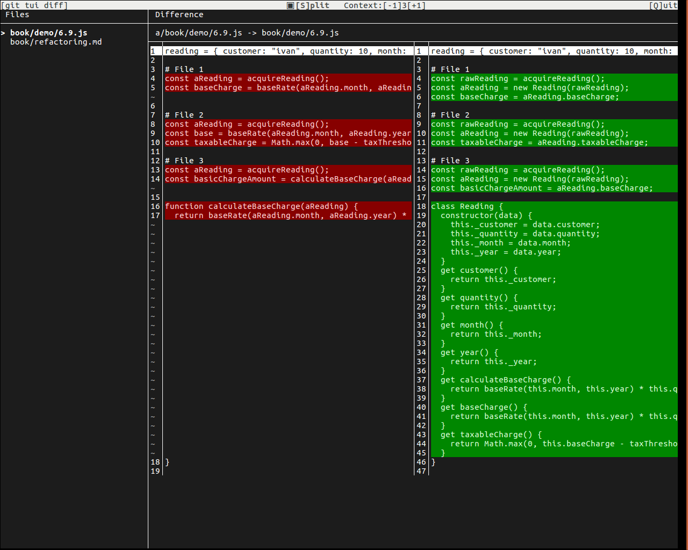
[返回](#return)

<h3 id="CombineFunctionsIntoTransform">函数组合成变换</h3>

  1. 创建一个变换函数，输入参数是需要变换的记录，并直接返回该记录的值
  1. 挑选一块逻辑，将其主体移入变换函数中，把结果作为字段添加到输出记录中
  1. 修改客户端代码，令其使用这个新字段
  1. 测试
  1. 针对其他相关的计算逻辑，重复上述步骤

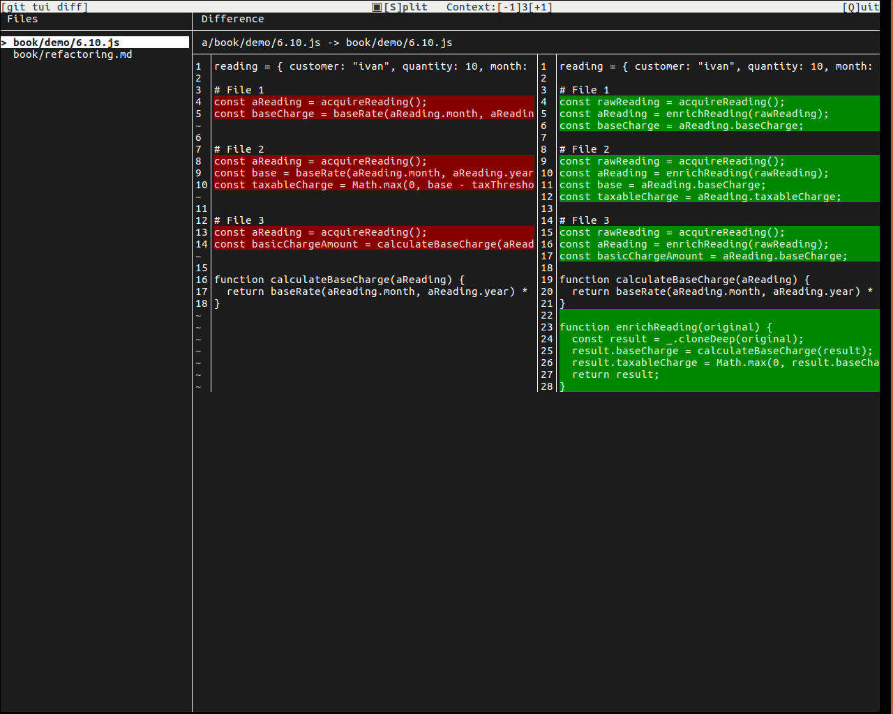
[返回](#return)

<h3 id="SplitPhase">拆分阶段</h3>

  1. 将第二阶段的代码提炼成独立的函数
  1. 测试
  1. 引入一个中转数据结构，将其作为参数添加到提炼出的新函数的参数列表中
  1. 测试
  1. 逐一检查提炼出的“第二阶段函数”的每个参数
  1. 对第一阶段的代码运用提炼函数，让提炼出的函数返回中转数据结构

[返回](#return)

<h3 id="EncapsulateRecord">封装记录</h3>

  1. 对持有记录的变量使用封装变量，将其封装到一个函数中
  1. 创建一个类，将记录包装起来，并将记录变量的值替换为该类的一个实例
  1. 在类上定义一个访问函数，用于返回原始的记录
  1. 修改封装变量的函数，令其使用这个访问函数
  1. 测试
  1. 新建一个函数，让它返回该类的对象，而非那条原始的记录
  1. 对于该记录的每处使用点，将原先返回记录的函数调用替换为那个返回实例对象的函数调用
  1. 移除类对原始记录的访问函数，那个容易搜索的返回原始数据的函数也要一并删除
  1. 测试
  1. 如果记录中的字段本身也是复杂结构，考虑对其再次应用封装记录或封装集合

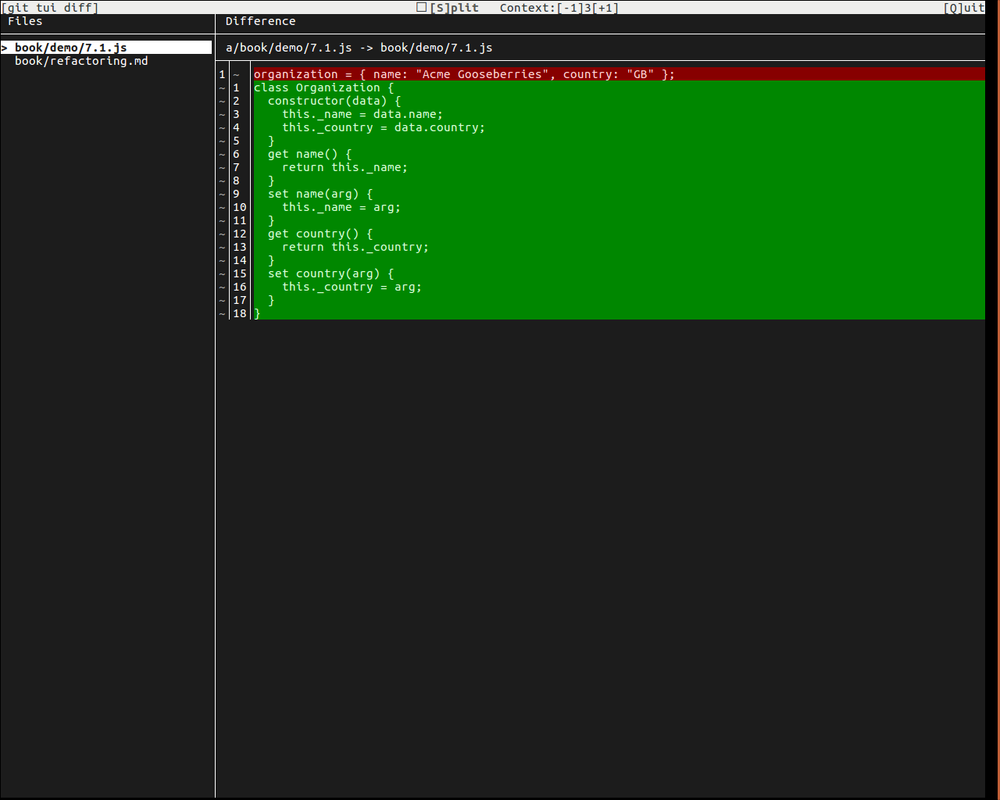
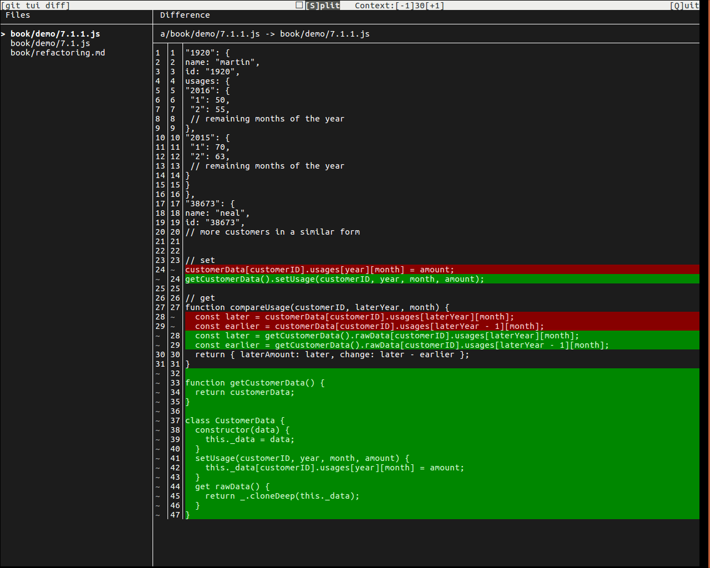
[返回](#return)

<h3 id="EncapsulateCollection">封装集合</h3>

  1. 封装变量封装集合的引用
  1. 在类上添加用于添加和移除集合的函数
  1. 静态检查
  1. 查找集合的引用点
  1. 修改集合的取值函数
  1. 测试

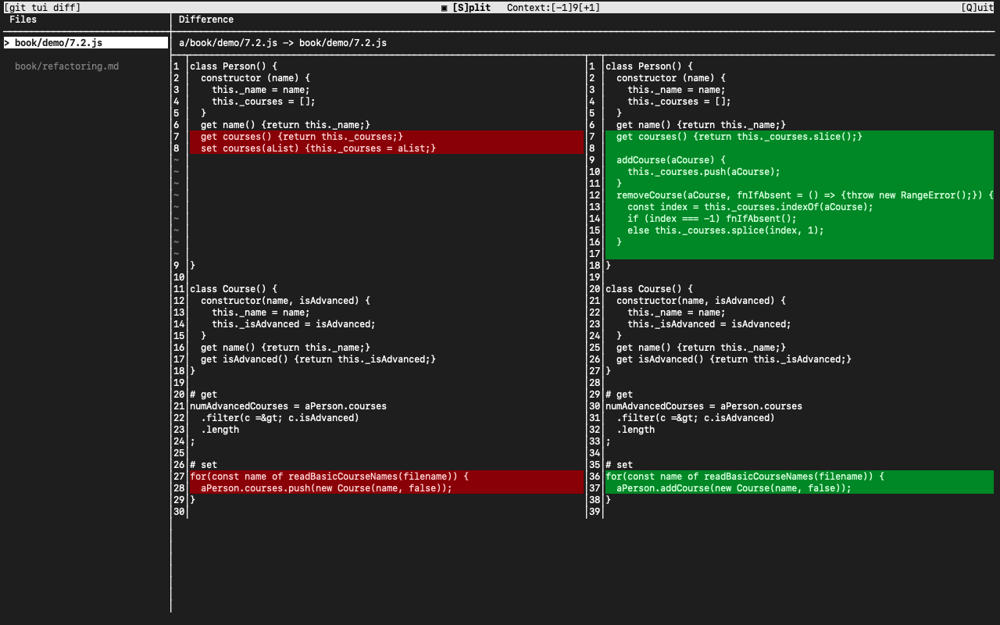
[返回](#return)

<h3 id="ReplacePrimitiveWithObject">以对象取代基本类型</h3>

  1. 封装变量
  1. 创建类，构造应该保存和取值
  1. 静态检查
  1. 修改设值函数
  1. 函数改名
  1. 明确指出新对象为值对象还是引用对象

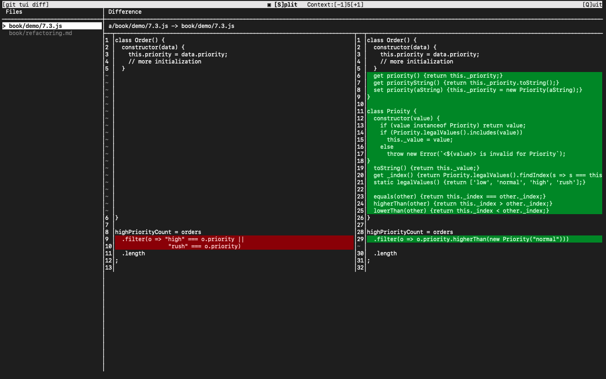
[返回](#return)

<h3 id="ReplaceTempWithQuery">以查询取代临时变量</h3>

  1. 检查变量是否每次都能得到一样的值
  1. 改造为只读变量
  1. 测试
  1. 将变量赋值的代码提炼函数
  1. 内联变量移除临时变量

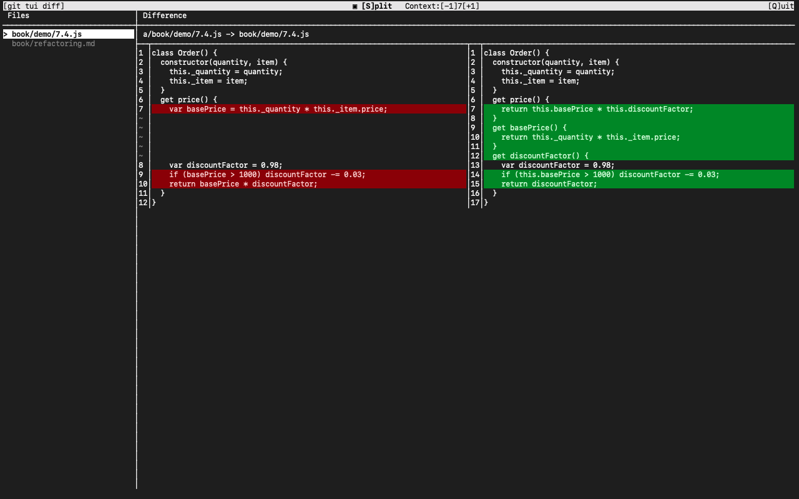
[返回](#return)

### 提炼类
  1.
  1.
  1.
  1.
  1.

[返回](#return)

### 内联类
  1.
  1.
  1.
  1.
  1.

[返回](#return)

### 隐藏委托关系
  1.
  1.
  1.
  1.
  1.

[返回](#return)

### 移除中间人
  1.
  1.
  1.
  1.
  1.

[返回](#return)

### 替换算法
  1.
  1.
  1.
  1.
  1.

[返回](#return)

### 搬移函数
  1.
  1.
  1.
  1.
  1.

[返回](#return)

### 搬移字段
  1.
  1.
  1.
  1.
  1.

[返回](#return)

### 搬移语句到函数
  1.
  1.
  1.
  1.
  1.

[返回](#return)

### 搬移语句到调用者
  1.
  1.
  1.
  1.
  1.

[返回](#return)

### 以函数调用取代内联代码
  1.
  1.
  1.
  1.
  1.

[返回](#return)

### 移动语句
  1.
  1.
  1.
  1.
  1.

[返回](#return)

### 拆分循环
  1.
  1.
  1.
  1.
  1.
[返回](#return)

### 以管道取代循环
  1.
  1.
  1.
  1.
  1.

[返回](#return)

### 移除死代码
  1.
  1.
  1.
  1.
  1.

[返回](#return)

### 拆分变量
  1.
  1.
  1.
  1.
  1.

[返回](#return)

### 字段改名
  1.
  1.
  1.
  1.
  1.

[返回](#return)

### 以查询取代派生变量
  1.
  1.
  1.
  1.
  1.

[返回](#return)

### 将引用对象改为值对象
  1.
  1.
  1.
  1.
  1.

[返回](#return)

### 将值对象改为引用对象
  1.
  1.
  1.
  1.
  1.

[返回](#return)

### 分解条件表达式
  1.
  1.
  1.
  1.
  1.

[返回](#return)

### 合并条件表达式
  1.
  1.
  1.
  1.
  1.

[返回](#return)

### 以卫语句取代嵌套条件表达式
  1.
  1.
  1.
  1.
  1.

[返回](#return)

### 以多态取代条件表达式
  1.
  1.
  1.
  1.
  1.

[返回](#return)

### 引入特例
  1.
  1.
  1.
  1.
  1.

[返回](#return)

### 引入断言
  1.
  1.
  1.
  1.
  1.

[返回](#return)

### 将查询函数和修改函数分离
  1.
  1.
  1.
  1.
  1.

[返回](#return)

### 函数参数化
  1.
  1.
  1.
  1.
  1.

[返回](#return)

### 移除标记参数
  1.
  1.
  1.
  1.
  1.

[返回](#return)

### 保持对象完整
  1.
  1.
  1.
  1.
  1.

[返回](#return)

### 以查询取代参数
  1.
  1.
  1.
  1.
  1.

[返回](#return)

### 以参数取代查询
  1.
  1.
  1.
  1.
  1.

[返回](#return)

### 移除设值函数
  1.
  1.
  1.
  1.
  1.

[返回](#return)

### 以工厂取代构造函数
  1.
  1.
  1.
  1.
  1.

[返回](#return)

### 以命令取代函数
  1.
  1.
  1.
  1.
  1.

[返回](#return)

### 以函数取代命令
  1.
  1.
  1.
  1.
  1.

[返回](#return)

### 函数上移
  1.
  1.
  1.
  1.
  1.

[返回](#return)

### 字段上移
  1.
  1.
  1.
  1.
  1.

[返回](#return)

### 构造函数本体上移
  1.
  1.
  1.
  1.
  1.

[返回](#return)

### 函数下移
  1.
  1.
  1.
  1.
  1.

[返回](#return)

### 以子类取代类型码
  1.
  1.
  1.
  1.
  1.

[返回](#return)

### 移除子类
  1.
  1.
  1.
  1.
  1.

[返回](#return)

### 提炼超类
  1.
  1.
  1.
  1.
  1.

[返回](#return)

### 折叠继承体系
  1.
  1.
  1.
  1.
  1.

[返回](#return)

### 以委托取代子类
  1.
  1.
  1.
  1.
  1.

[返回](#return)

### 以委托取代超类
  1.
  1.
  1.
  1.
  1.

[返回](#return)

